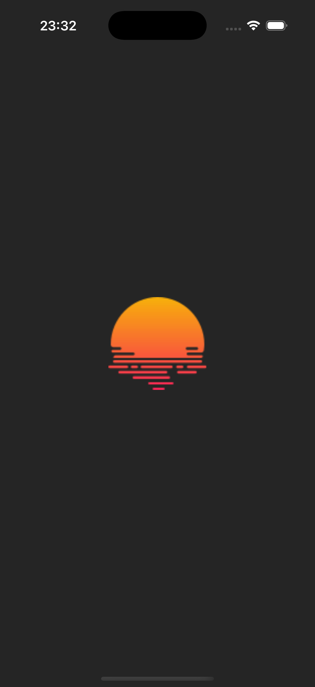
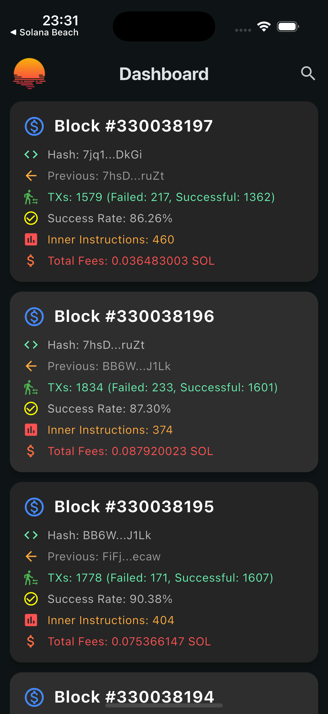
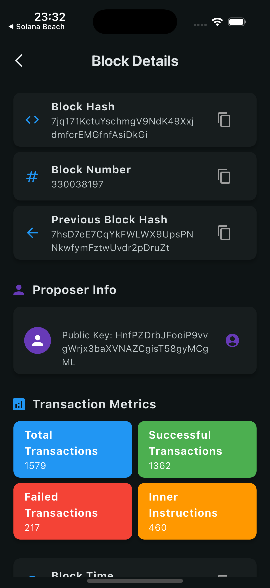

# 🚀 Solana Beach Dashboard App

Hello, Jakob and TUM Blockchain Club team!  

Welcome to the **Blockchain Dashboard App**, a sleek and intuitive Flutter application designed to monitor blockchain activity efficiently. This app provides real-time block data, transaction success rates, and detailed insights in a user-friendly interface.

As far as I understood, the essence of the test task was to replicate the functionality of the “Blocks” section from https://solanabeach.io/blocks.

This application repeats the functionality of this section, without affecting other sections of the website that affect the functionality of the “Blocks” section (for example, the “Validators” section in the mobile application should be made as a separate screen, but in my version, instead of redirecting to another screen, the user is redirected to the website itself).

---

## 📸 Screenshots

Here are some snapshots of the app running on an iPhone simulator:

<p align="center">
  
  
  
</p>

## 🛠 How to Run the App

Follow these steps to get started with the app on your local machine:

### 1️⃣ Clone the repository:
```sh
git clone https://github.com/yourusername/blockchain-dashboard.git
cd blockchain-dashboard
```
### 2️⃣ Install dependencies:
```
flutter pub get
```
### 3️⃣ Run the app:
Quick note: even though none of the http requests used in this application actually require an api key to get `200`, I still added it to the header according to the documentation and stored it as an environment variable. The next steps will involve running the application with the provided api key.  


You have two options to provide the API key:

✅ Recommended: Use an .env file

1.	Create a .env file in the project’s root directory.
2.	Add your API key to the file:
``` env
API_KEY=your_api_key_here
```
3.	Run the app using the following command:
```sh
flutter run --dart-define-from-file=.env
```
🔧 Alternative: Pass the API key directly

If you prefer, you can pass the API key as a command-line argument:
```sh
flutter run --dart-define=API_KEY=your_api_key_here
```

*The recommended approach ensures better security and easier key management.*

### Conclusion

All in all the project was done in a couple hours on Saturday. This test task shows that I am capable of accomplishing the task in the time allotted. Due to certain peculiarities of the website itself and for the purpose of similarity with it, some, in my opinion, important and easy to implement features (for example, dynamic theme change and localization) were not added to the mobile application. Although the pure architecture of this project allows developers to easily add such features.

I really hope that you will be satisfied with my work. I hope for further work on Solana Beach project!
